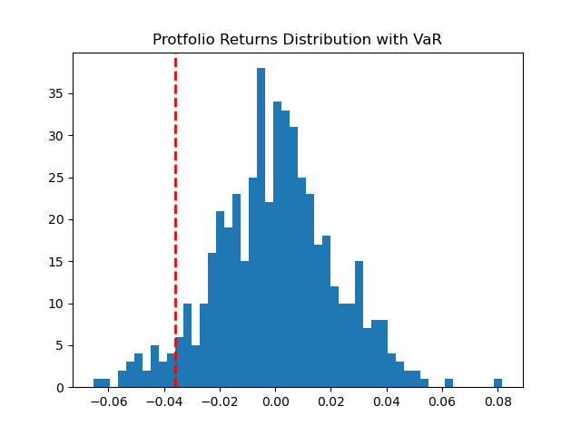
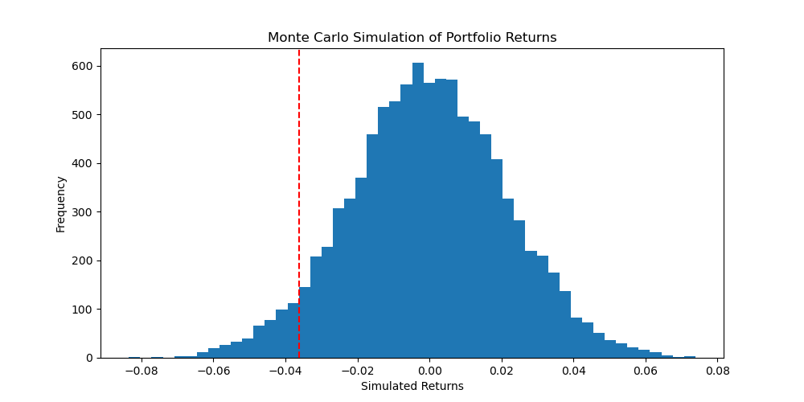
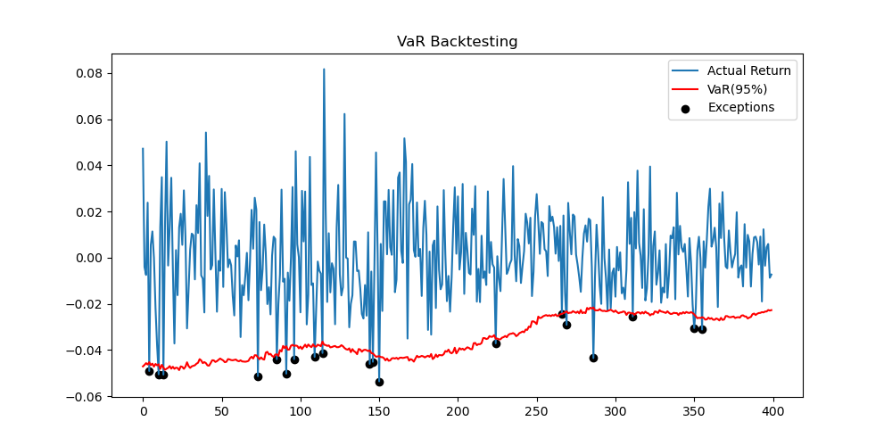

# Portfolio Risk Analysis with VaR and Backtesting

## Overview

This project analyzes the risk of a portfolio composed of:

- AAPL
- MSFT
- TSLA

using:

- Historical VaR
- Monte Carlo Simulation
- VaR Backtesting

The objective is to estimate potential portfolio losses and evaluate model performance over time.

---

## Methods

### Historical VaR
- Calculated daily portfolio returns
- Estimated 95% VaR using historical return distribution
- 

### Monte Carlo VaR
- Simulated 10,000 portfolio return scenarios
- Assumed normally distributed returns
- 

### VaR Backtesting
- Implemented rolling 100-day VaR estimation
- Compared predicted VaR with actual returns
- Backtesting exception rate: 5.0% (n=400+ trading days) — exactly in line with the theoretical 95% confidence level and within the Basel II green zone (< 5 exceptions per 250 days)
- 

---

## Results

The model successfully:
- Estimated portfolio downside risk using three complementary methods
- Achieved backtesting exception rate of 5.0% — matching the theoretical 95% 
  confidence level exactly
- Identified and visualised VaR breach events across 400+ trading days
---

## Tools

- Python
- pandas
- numpy
- matplotlib
- yfinance

---

## Key Skills Demonstrated

- Financial data analysis
- Risk modeling
- Monte Carlo simulation
- Backtesting
- Data visualization

---

## Future Improvements

Possible improvements include:

- GARCH volatility modeling
- Fat-tail distributions
- Expected Shortfall (CVaR)
